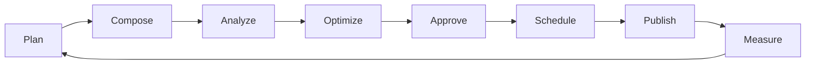
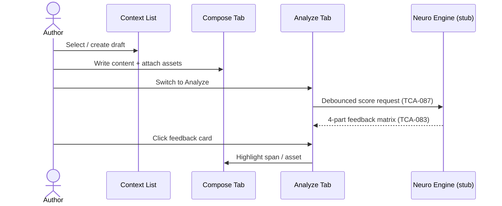
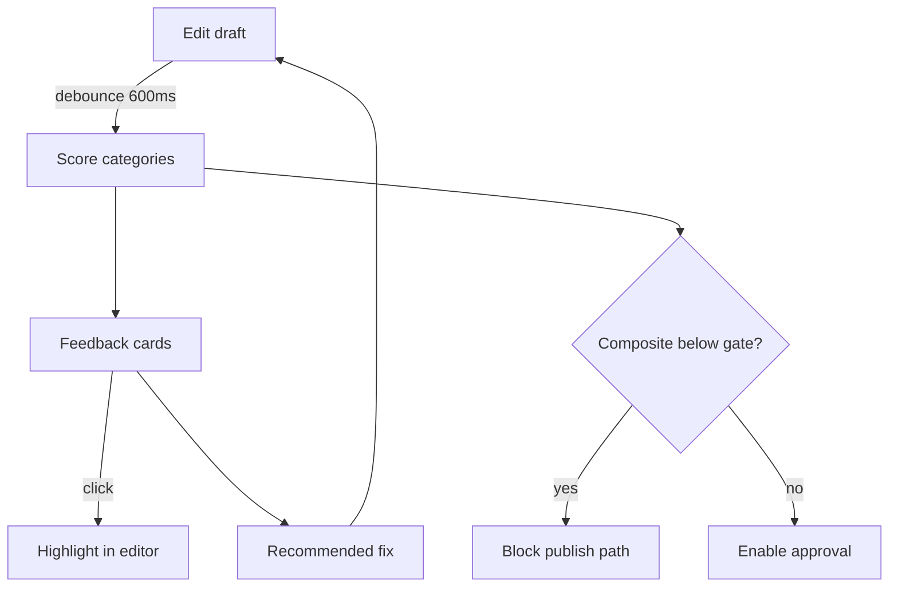
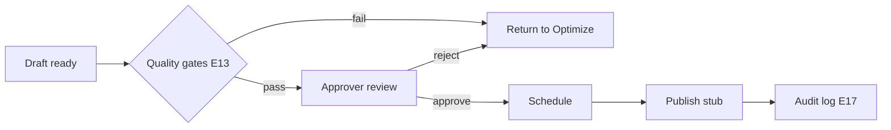
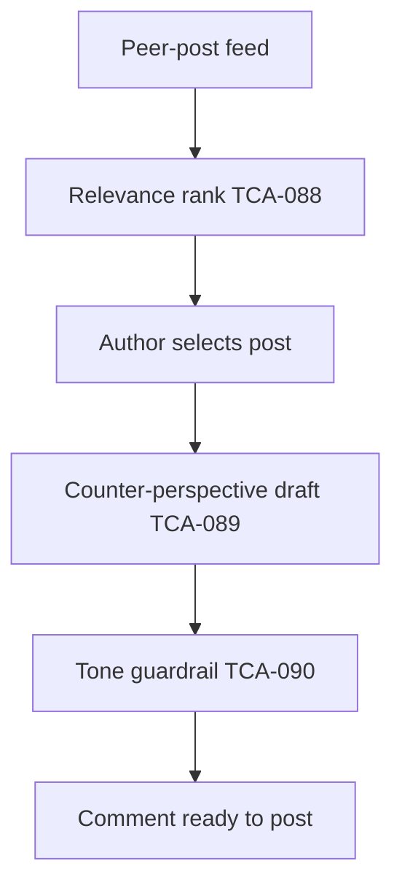

# Audira Studio — UX Design Brief

**Product:** Audira.run — Enterprise Communications Neuro-Analyzer  
**Shell pattern:** Three-zone IA (module rail · context list · tabbed workspace) — *behaviour only*, not Teams visual clone  
**Scope source:** Competitive backlog `TCA-001`…`TCA-092` across epics `E01`–`E22`

---

## 1. Primary Personas & Jobs-to-be-Done

### Account / Content Manager
**Core loop:** Connect channels → queue drafts → monitor scores → route for approval → schedule publish → review program health.

Runs daily across Social, LinkedIn, Placement, and Blog. Needs a single **Command Center** with attention badges (low scores, pending approvals, failed publishes). Primary JTBD: *"Tell me what needs my action before it goes out wrong."*

### Content Strategist
**Core loop:** Set audience & objective context → compose variant → analyze effectiveness → compare A/B → optimize messaging pillars → measure lift.

Uses the **analyzer feedback loop** heavily (E06–E09, E19–E21). JTBD: *"Improve message-market fit before spend or reputation cost."*

### ML / Platform Engineer
**Core loop:** Monitor inference queue → validate model cards → tune orchestration → observe latency/cost → escalate guardrail failures.

Lives in **Governance & Admin** + backend observability stubs. JTBD: *"Keep prediction quality and SLA within policy without blocking authors."*

### Admin / Governance Owner
**Core loop:** Configure taxonomy & standards → set quality gates → manage RBAC/SSO → audit access → publish rule updates.

Owns **Governance & Admin** module. JTBD: *"Ensure every artifact is in-scope, compliant, and traceable."*

### Compliance / Policy Officer
**Core loop:** Review inclusivity/bias flags → validate data residency → approve high-risk content → audit model usage.

Uses guardrail surfaces (E15, E16, E17). JTBD: *"Prove we did not publish non-compliant or out-of-licence content."*

---

## 2. The Core Content Loop

Every vertical (Social, LinkedIn, Placement, Blog) is an instance of the same lifecycle:

| Stage | User intent | Primary UI surfaces |
|-------|-------------|---------------------|
| **Plan** | Audience, objective, channel rules | Context list filters, persona picker (TCA-077) |
| **Compose** | Draft + assets | Compose tab, multimodal drop zone (TCA-079) |
| **Analyze** | Neuro scores & matrix | Analyze tab, 4-part feedback matrix (TCA-083) |
| **Optimize** | Fixes, rewrites, variants | Feedback cards, rewrite assist (TCA-044), A/B (TCA-040) |
| **Approve** | Quality gates | Governance approval board (E13) |
| **Schedule** | Channel timing | Schedule tab |
| **Publish** | Push to channel | Integration stubs per vertical |
| **Measure** | Dashboards & benchmarks | Analytics module (E14) |

---

## 3. Information Architecture — Three-Zone Shell

### Zone 1 — Module Rail (far left, collapsible)

| Module | Badge logic | Purpose |
|--------|-------------|---------|
| **Home / Command Center** | Total attention items | Cross-channel dashboard |
| **Social** | Drafts needing score review | Instagram, Facebook, TikTok, YouTube Shorts, X |
| **LinkedIn** | Engagement queue + low-score drafts | Technical thought leadership |
| **Placement** | JDs pending bias check | Naukri, Times Jobs, Monster, Indeed |
| **Blog** | SEO queue items | Medium, WordPress, personal blog |
| **Analytics** | — | Program insights & scorecards |
| **Asset Library** | Unprocessed uploads | Diagrams, code, images (TCA-079) |
| **Governance & Admin** | Pending approvals | Standards, gates, audit, model cards |
| **Settings** | Connection errors | SSO, RBAC, residency, integrations |

Rail is **icon-first**, 56px expanded / 48px collapsed. Keyboard: `Alt+1`…`Alt+9` module jump.

### Zone 2 — Context List (middle, resizable)

Changes per module. Each list has:
- **Header** — module name + primary action (`+ New draft`, `Connect account`)
- **Filter pills** — contextual subsets (mirrors Teams Unread/Channels/Chats pattern)
- **Collapsible sections** — grouped list rows with status dot + score chip

**Social:** Connected accounts · Campaigns · Drafts · Scheduled · Published  
Pills: `Drafts` · `Scheduled` · `Published` · `Needs review`

**LinkedIn:** Personas · Drafts · Engagement queue · Published  
Pills: `Drafts` · `Scheduled` · `Published` · `Engagement`

**Placement:** Job posts · Candidate comms · Agency channels  
Pills: `Drafts` · `In review` · `Live`

**Blog:** Series · Drafts · Published · SEO queue  
Pills: `Drafts` · `Scheduled` · `Published` · `SEO`

**Analytics:** Dashboards · Team scorecards · Benchmarks · Exports

**Governance:** Standards · Quality gates · Approvals · Audit log · Model cards

### Zone 3 — Tabbed Workspace (main, resizable split)

Per selected context item:

| Tab | Content |
|-----|---------|
| **Compose** | Editor + asset attachments |
| **Analyze** | Split-panel workspace (TCA-091) — editor left, feedback matrix right |
| **Schedule** | Calendar / queue |
| **Insights** | Per-item metrics & history |
| **Assets** | Linked media & code blocks |
| **Activity** | Comments, approvals, version log |

LinkedIn **Analyze** tab is the **signature build**: persona picker, anti-generic wizard entry, multimodal drop zone, composite score header (TCA-038), debounced live cards (TCA-087).

Global top bar (above all zones): **Search / Ask Audira** command box, connection status, theme toggle, user menu.

---

## 4. Key Flow Diagrams

### (a) Create & Analyze a Post

### (b) Analyzer Feedback Loop

### (c) Approval Gate → Publish

### (d) Engagement / Comment Helper (E22)

---

## 5. Global States

| State | Trigger | UI treatment |
|-------|---------|--------------|
| **Empty** | No items in context list | Illustration + CTA (`Create first draft`, `Connect channel`) |
| **Loading** | Route change / score refresh | Skeleton rows in list; shimmer on feedback cards |
| **Error** | Score API failure | Inline banner + retry; preserve editor content |
| **No connection** | Integration offline | Amber status in top bar; disabled publish with tooltip |
| **Permission denied** | RBAC block (TCA-067) | Full-panel lock with role hint + link to admin |

All states preserve the three-zone shell — never navigate away silently.

---

## 6. Visual Identity Notes (Phase 3)

- **Not Teams:** No purple chat aesthetic. Calm, data-dense analytics product.
- **Palette:** Deep slate surfaces, teal primary, amber accent for attention, semantic score colours.
- **Motif:** Score chips (0–10 / 0–100) and Feedback Cards everywhere scores appear.
- **Typography:** Outfit (display) + IBM Plex Sans (body).
- **Themes:** Light + dark via CSS variables; WCAG AA contrast on all score states.

---

*Prepared for Audira Studio greenfield scaffold — aligns with backlog epics E01–E22 and model-agnostic, compliance-first strategy from Read Me sheet.*
